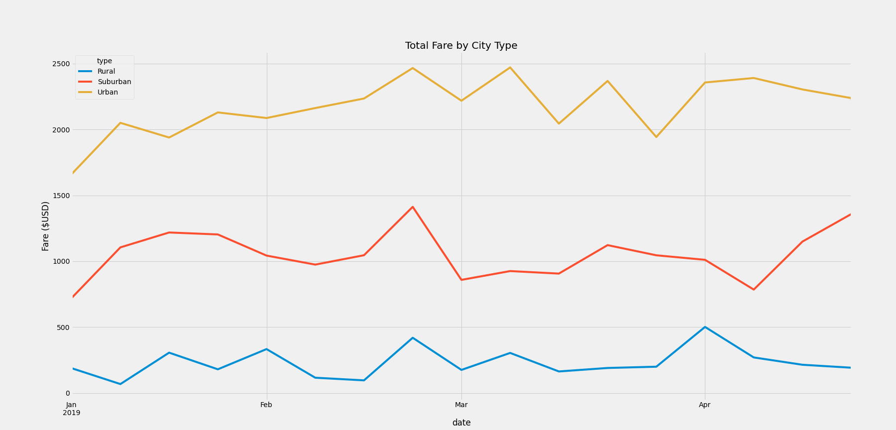

# PyBer_Analysis

## Overview
The purpose of this analysis was to analyze data from a python based ride-sharing app company called PyBer.  We were presented with ride-share data in csv format which we used to perform exploratory analysis.  Our goal was to create a summary DataFrame of ride sharing data by city type (ie. Urban, Suburban or Rural) and produce a visualization that tells a story about the data.
## Results
In order to best display the data produced from the analysis, the following line graph was created to show the total fare by city type.

When examining this chart, one of the first and most obvious things that is noticed is that population density seems to have a significant affect on the fares with Urban city types being the highest, rural city types being the lowest and suburban city types in between.  The data is so vastly different between city types that the lines on our graph never overlap each other.  A common trend that we see regardless of city type is that the fares all seemed to spike towards the end of February and then all dropped at the beginning of March.  These data points don't appear to be outliers compared to the rest of the data so it would be interesting to know if there was some sort of event that happened to cause this data fluctuation in the region where the data was collected.
## Summary
After examining the results from the PyBer analysis, there are a three recommendations I would make in regards to the disparities among city types.
1. Because the urban city type has the highest total fare by city type, we should focus on hiring more drivers in urban areas.
2. Because the rural city type has the lowest fare by city type, we should consider increasing the rates for service in rural areas to compensate for the lower fares.
3. Because the suburban fares are higher than the rural fares, we could consider incentivizing drivers from rural areas to drive in suburban areas.  This process could also be applied to incentivize the suburban drivers to drive in urban areas.